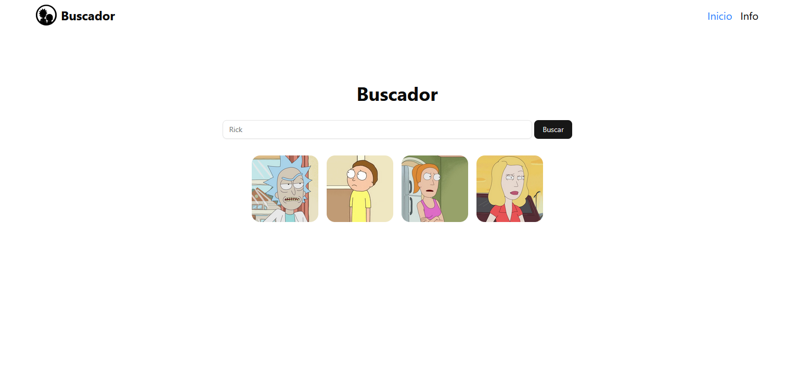

# 🔍 Buscador de Personajes - Rick and Morty

Proyecto simple creado con fines de práctica. Permite buscar personajes de la serie **Rick and Morty** utilizando la [Rick and Morty API](https://rickandmortyapi.com/).

## 📸 Captura

## 

## 🚀 Tecnologías utilizadas

- 🧑‍🚀 Vite / React
- 🎨 UI: TailwindCSS + Shadcn/ui
- 🔗 [Rick and Morty API](https://rickandmortyapi.com/)

---

## ⚙️ Instalación y ejecución

```bash
# Clona el repositorio
git clone https://github.com/teby00/rick-and-morty-search.git
cd rick-and-morty-search

# Instala dependencias
npm install

# Ejecuta el proyecto
npm run dev
```
